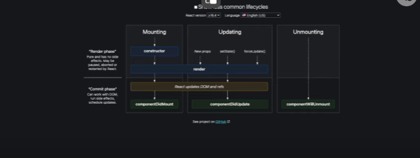

# Lifecyce
Siklus hidup setiap komponent dalam react diantaranya:
1. Mounting : ketika komponen diciptakan
2. Updating: fase dimana komponen berkembang adanya perubahan
3. Unmounting: Fake ketika komponen dihancurkan

["https://www.youtube.com/watch?v=XuEnN8SBiy4&list=PLmF_zPV9ZcP346sttD4Vs2VROLlIp5kPz&index=13"]

- Component DidMount : Fetching data ke API  jika bekerja dengan API
- Component DiMount : Update jika terjadi peruhbahan
- Component Unmounting: Proses penghapusan komponen dari halaman web

Untuk melihat lifescycle bisa ke inspect elemet

- Component DidMount, Update dll hanya bisa digunakan di class component, untuk functional component menggunakan hooks