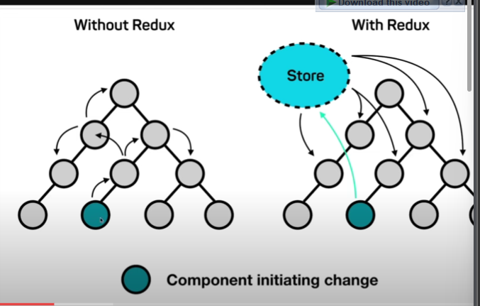
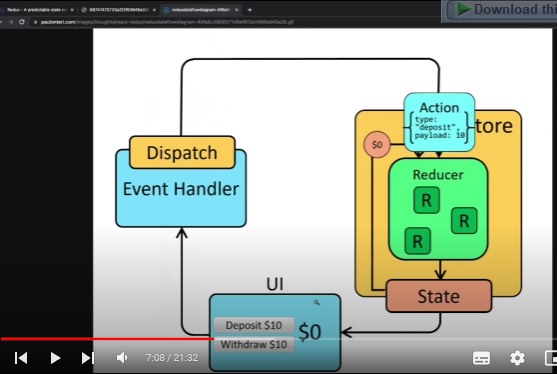

# Redux State Management
Redux adalah sebuah library untuk manajemen state dalam aplikasi JavaScript, terutama yang berbasis React. Redux digunakan untuk menyimpan dan mengelola state aplikasi secara terpusat, membuatnya lebih mudah diakses dan diubah oleh komponen-komponen aplikasi.

Beberapa alasan mengapa Redux digunakan untuk manajemen state dalam aplikasi termasuk:

1. Kepatuhan terhadap Prinsip Redux: Redux menerapkan arsitektur unidirectional data flow, yang mengikuti prinsip-prinsip yang jelas dan memudahkan pengembangan aplikasi yang terorganisir dan mudah dipahami.
2. Skalabilitas: Redux cocok untuk aplikasi dengan kompleksitas tinggi dan skala besar. Dengan menyimpan semua state aplikasi dalam satu store global, Redux memungkinkan manajemen state yang efisien dan terstruktur, yang membuat aplikasi lebih mudah dikelola saat kompleksitasnya meningkat.
3. Prediktabilitas: Dengan mengadopsi pola unidirectional data flow, Redux membuat aliran data dalam aplikasi lebih mudah diprediksi dan dipahami. Ini memungkinkan pengembang untuk melacak dan memahami perubahan state dengan lebih baik, membuat debugging dan pengembangan lebih efisien.
4. Memisahkan Logika dan Tampilan: Redux membantu memisahkan logika aplikasi dari tampilan, dengan menyimpan semua logika state dalam store terpusat. Ini memungkinkan komponen-komponen React untuk fokus pada tampilan mereka tanpa harus khawatir tentang logika state yang kompleks.
5. Pengelolaan State yang Terpusat: Dengan menyimpan semua state aplikasi dalam satu store global, Redux memungkinkan pengelolaan state yang terpusat dan konsisten. Ini membuat mudah untuk membagi state menjadi bagian-bagian yang lebih kecil dan memastikan bahwa state selalu konsisten di seluruh aplikasi.

Meskipun Redux dapat memberikan manfaat yang signifikan dalam pengembangan aplikasi yang besar dan kompleks, perlu diingat bahwa penggunaan Redux juga dapat meningkatkan kompleksitas kode. Oleh karena itu, penting untuk mengevaluasi apakah Redux merupakan pilihan yang tepat untuk aplikasi Anda berdasarkan kebutuhan dan skala proyek yang Anda kerjakan.

- Jadi State management itu digunakan untuk memudahkanmengirim state tanpa harus menggunakna props

- Dengan menggunakan redux state tidak disimpan dalam parent melainkan disimpan dalam store.

- contoh implementasi redux dapat dilihat pada redux.js

# installasi redux
> npm i redux

- Dalam redux, kita akan mengenal dispatch yang digunakan sebagai event handler
- kemudian ada reducer, state, dan UI

